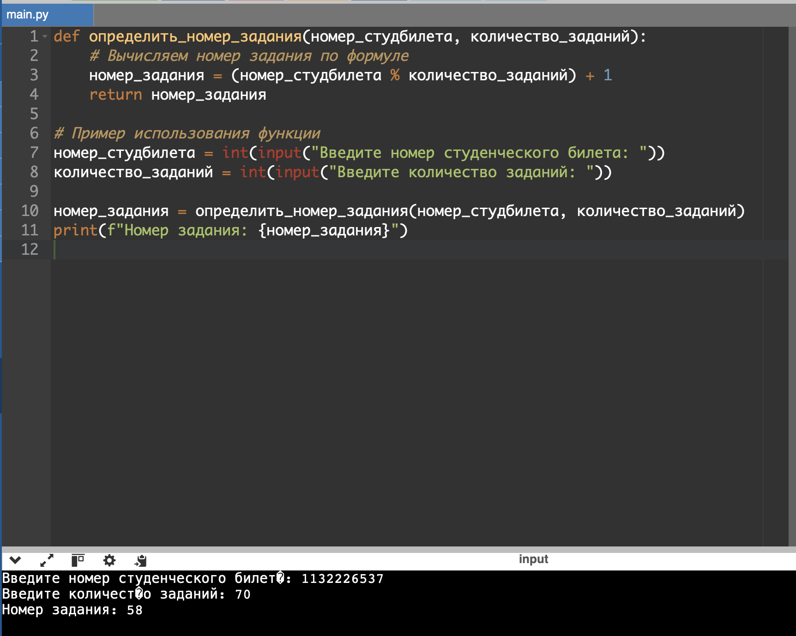
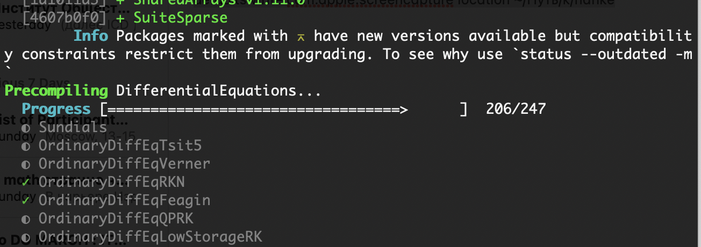
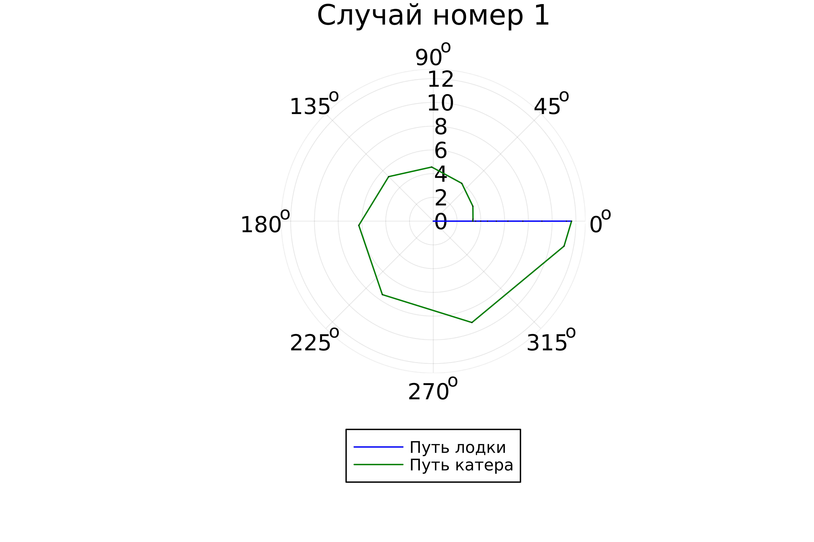
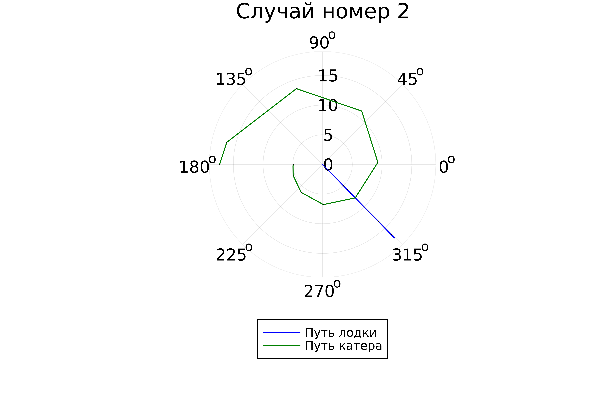

---
## Front matter
lang: ru-RU
title: Лабораторная работа №2
subtitle: Задача о погоне
author:
  - Нефедова Н.Н. 
institute:
  - Российский университет дружбы народов, Москва, Россия
date: 6 марта 2024

## i18n babel
babel-lang: russian
babel-otherlangs: english

## Formatting pdf
toc: false
toc-title: Содержание
slide_level: 2
aspectratio: 169
section-titles: true
theme: metropolis
header-includes:
 - \metroset{progressbar=frametitle,sectionpage=progressbar,numbering=fraction}

---

# Информация

## Докладчик

:::::::::::::: {.columns align=center}
::: {.column width="70%"}

  * Нефедова Наталия Николавна
  * Студент
  * Обучающийся на кафедре математического моделирования и искусственного интеллекта
  * Российский университет дружбы народов
  * <https://github.com/nnnefedova>

:::
::::::::::::::

# Вводная часть

## Цель работы

Решить задачу о погоне и изучить основы языка программирования Julia.

## Задание
1. Запишите уравнение, описывающее движение катера, с начальными условиями для двух случаев (в зависимости от расположения катера относительно лодки в начальный момент времени). 
2. Постройте траекторию движения катера и лодки для двух случаев. 
3. Найдите точку пересечения траектории катера и лодки.

# Выполнение лабораторной работы 

Рассчитаем свой вариант по формуле и получаем наш вариант - 58

{ #fig:001 width=70%}

## 1. На море в тумане катер береговой охраны преследует лодку браконьеров.
Через определенный промежуток времени туман рассеивается, и лодка
обнаруживается на расстоянии 20,2 км от катера. Затем лодка снова скрывается в
тумане и уходит прямолинейно в неизвестном направлении. Известно, что скорость
катера в 5,1 раза больше скорости браконьерской лодки.

## 2. Примем за момент отсчета времени момент первого рассеивания тумана. Введем полярные координаты с центром в точке нахождения браконьеров и осью, проходящей через катер береговой охраны. Тогда начальные координаты катера (20,2; 0). Обозначим скорость лодки v.

3. Траектория катера должна быть такой, чтобы и катер, и лодка все время были на одном расстоянии от полюса. Только в этом случае траектория катера пересечется с траекторией лодки. Поэтому для начала катер береговой охраны должен двигаться некоторое время прямолинейно, пока не окажется на том же расстоянии от полюса, что и лодка браконьеров. После этого катер береговой охраны должен двигаться вокруг полюса удаляясь от него с той же скоростью, что и лодка браконьеров.

## 4. Пусть время t -  время, через которое катер и лодка окажутся на одном расстоянии от начальной точки. 
$$ t = \frac{x}{v} $$
$$ t = \frac{20.2-x}{5.1v} $$
$$ t = \frac{20.2+x}{5.1v} $$
## Из этих уравнений получаем объединение двух уравнений:

$$ \left\{ \begin{array}{cl}
\frac{x}{v} = \frac{20.2-x}{5.1v} \\
\frac{x}{v} = \frac{20.2+x}{5.1v}
\end{array} \right. $$

## Решая это, получаем два значения для x:
$$ x_1 = 3.311 $$
$$ x_2 = 4.927 $$

$$ v_\tau  $$ – тангенциальная скорость
$$ v $$ – радиальная скорость
$$ v = \frac{dr}{dt} $$
$$ v_\tau = \frac{\sqrt{(5.1v)^2 - v^2}}{10} = \frac{\sqrt{2501}v}{10} $$

# Уравнение
## Часть уравнения
$$ \left\{ \begin{array}{cl}
\frac{dr}{dt} = v \\
r\frac{d\theta}{dt} = \frac{\sqrt{2501}v}{10}
\end{array} \right. $$

## Итоговое уравнение после того, как убрали производную по t:

$$ \frac{dr}{d\theta} = \frac{10r}{\sqrt{2501}} $$

## Моделирование с помощью Julia

# Работа с Julia

## 1. Скачиваем Julia .

## 2. Запускаем Julia .

{#fig:002 width=70%}

## 3. Процесс запуска Julia

{#fig:004 width=70%}

## 4. Скачаем необходимые для работы пакеты 

{#fig:003 width=70%}

## 5. Запуск кода 

{#fig:005 width=70%}

## 6. Просмотр результата работы.

{#fig:006 width=70%}

## 7. Просмотр результата работы.

{#fig:007 width=70%}

## Выводы

Были изучены основы языка программирования Julia и его библиотеки, которые используются для построения графиков и решения дифференциальных уравнений. А также решили задачу о погоне.

## Список литературы 

[1] Документация по Julia: https://docs.julialang.org/en/v1/

[2] Решение дифференциальных уравнений: https://www.wolframalpha.com/
