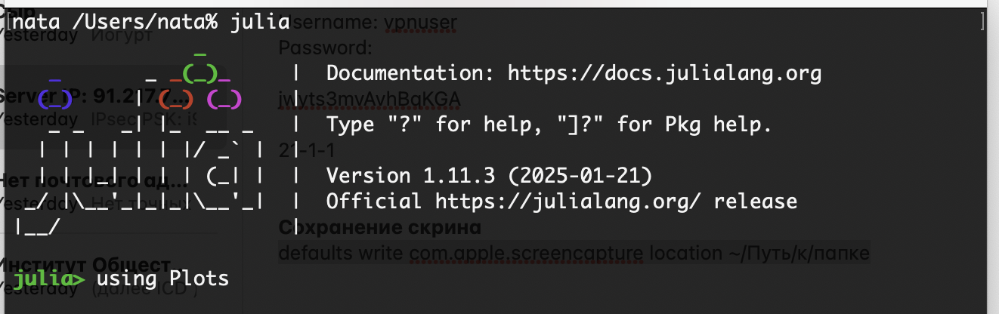
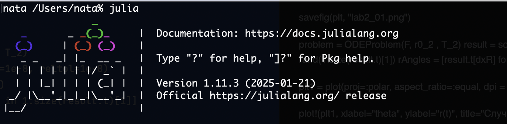
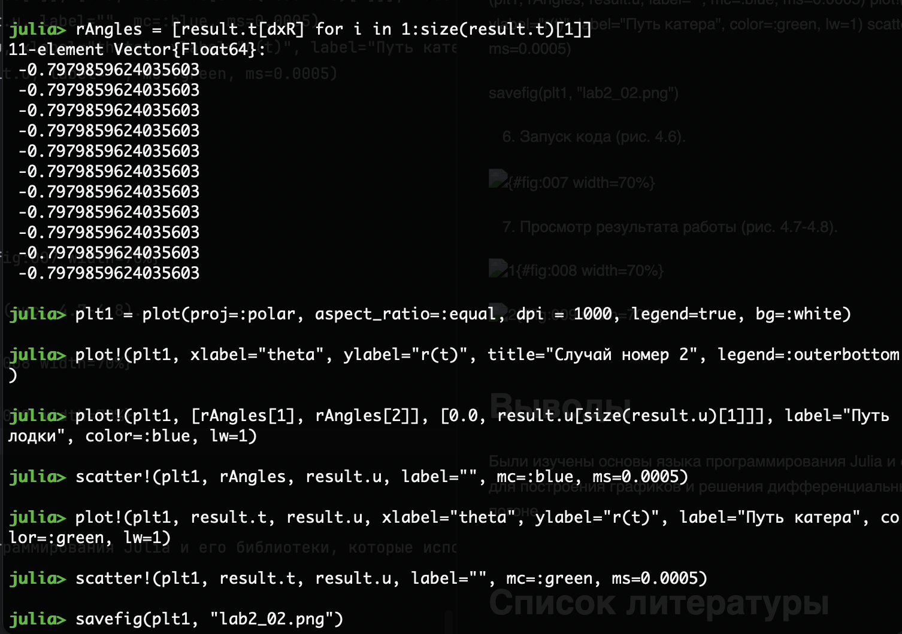

---
## Front matter
title: "Отчет по лабораторной работе №2"
subtitle: "Задача о погоне"
author: "Нефедова Наталия"

## Generic otions
lang: ru-RU
toc-title: "Содержание"

## Bibliography
bibliography: bib/cite.bib
csl: pandoc/csl/gost-r-7-0-5-2008-numeric.csl

## Pdf output format
toc: true # Table of contents
toc-depth: 2
lof: true # List of figures
#lot: true # List of tables
fontsize: 12pt
linestretch: 1.5
papersize: a4
documentclass: scrreprt
## I18n polyglossia
polyglossia-lang:
  name: russian
  options:
	- spelling=modern
	- babelshorthands=true
polyglossia-otherlangs:
  name: english
## I18n babel
babel-lang: russian
babel-otherlangs: english
## Fonts
mainfont: PT Serif
romanfont: PT Serif
sansfont: PT Sans
monofont: PT Mono
mainfontoptions: Ligatures=TeX
romanfontoptions: Ligatures=TeX
sansfontoptions: Ligatures=TeX,Scale=MatchLowercase
monofontoptions: Scale=MatchLowercase,Scale=0.9
## Biblatex
biblatex: true
biblio-style: "gost-numeric"
biblatexoptions:
  - parentracker=true
  - backend=biber
  - hyperref=auto
  - language=auto
  - autolang=other*
  - citestyle=gost-numeric
## Pandoc-crossref LaTeX customization
figureTitle: "Рис."
tableTitle: "Таблица"
listingTitle: "Листинг"
lofTitle: "Список иллюстраций"
lotTitle: "Список таблиц"
lolTitle: "Листинги"
## Misc options
indent: true
header-includes:
  - \usepackage{indentfirst}
  - \usepackage{float} # keep figures where there are in the text
  - \floatplacement{figure}{H} # keep figures where there are in the text
---

# Цель работы

Решить задачу о погоне и изучить основы языка программирования Julia.

# Задание
1. Запишите уравнение, описывающее движение катера, с начальными условиями для двух случаев (в зависимости от расположения катера относительно лодки в начальный момент времени). 
2. Постройте траекторию движения катера и лодки для двух случаев. 
3. Найдите точку пересечения траектории катера и лодки

# Выполнение лабораторной работы 

Рассчитаем свой вариант по формуле и получаем наш вариант - 58

{ #fig:001 width=70%}

1. На море в тумане катер береговой охраны преследует лодку браконьеров.
Через определенный промежуток времени туман рассеивается, и лодка
обнаруживается на расстоянии 20,2 км от катера. Затем лодка снова скрывается в
тумане и уходит прямолинейно в неизвестном направлении. Известно, что скорость
катера в 5,1 раза больше скорости браконьерской лодки.

2. Примем за момент отсчета времени момент первого рассеивания тумана. Введем полярные координаты с центром в точке нахождения браконьеров и осью, проходящей через катер береговой охраны. Тогда начальные координаты катера (20,2; 0). Обозначим скорость лодки v.

3. Траектория катера должна быть такой, чтобы и катер, и лодка все время были на одном расстоянии от полюса. Только в этом случае траектория катера пересечется с траекторией лодки. Поэтому для начала катер береговой охраны должен двигаться некоторое время прямолинейно, пока не окажется на том же расстоянии от полюса, что и лодка браконьеров. После этого катер береговой охраны должен двигаться вокруг полюса удаляясь от него с той же скоростью, что и лодка браконьеров.

4. Пусть время t -  время, через которое катер и лодка окажутся на одном расстоянии от начальной точки. 
$$ t = {{x }\over{v}} $$
$$ t = {{20,2-x}\over{5,1 v}} $$
$$ t = {{20,2+x}\over{5,1 v}} $$

Из этих уравнений получаем объедиение двух уравнений:

$$ \left[ \begin{array}{cl}
{{x}\over{v}} = {{20,2-x}\over{5,1 v}}\\
{{x}\over{v}} = {{20,2+x}\over{5,1 v}}
\end{array} \right. $$

Решая это, получаем два значения для x:
$$ x1 = {{3.311}} $$
$$ x2 = {{4.927}} $$

$$ v_\tau  $$ – тангенциальная скорость
$$ v $$ – радиальная скорость
$$ v = {dr\over dt} $$
$$ v_\tau = {{\sqrt{((5,1*v)^2-v^2)}}} = {\sqrt{2501}*v \over{10}}   $$

$$ \left\{ \begin{array}{cl}
{dr\over dt} = v \\
r{d\theta\over dt} = {\sqrt{2501}*v \over{10}} 
\end{array} \right. $$

$$ \left\{ \begin{array}{cl}
\theta_0 = 0 \\
r_0 = x_1 = {{3.311}}
\end{array} \right. $$

или

$$ \left\{ \begin{array}{cl}
\theta_0 = -\pi \\
r_0 = x_2 = {{4.927}}
\end{array} \right. $$

Итоговое уравнение после того, как убрали производную по t:

$$ {dr\over d\theta} = {10r\over\sqrt{2501}} $$

# Моделирование с помощью Julia

1. Скачиваем Julia .

2. Запускаем Julia .

{#fig:002 width=70%}

3. Процесс запуска Julia

{#fig:004 width=70%}

4. Скачаем необходимые для работы пакеты 

{#fig:003 width=70%}

5. Код для файла lab2.jl:

using Plots
using DifferentialEquations

const a = 20.2
const n = 5.1

const r0 = a/(n + 1)
const r0_2 = a/(n - 1)

const T = (0, 2*pi)
const T_2 = (-pi, pi)

function F(u, p, t)
return u / sqrt(n*n - 1)
end

problem = ODEProblem(F, r0, T)

result = solve(problem, abstol=1e-8, reltol=1e-8)
@show result.u
@show result.t

dxR = rand(1:size(result.t)[1])
rAngles = [result.t[dxR] for i in 1:size(result.t)[1]]

plt = plot(proj=:polar, aspect_ratio=:equal, dpi = 1000, legend=true, bg=:white)

plot!(plt, xlabel="theta", ylabel="r(t)", title="Случай номер 1", legend=:outerbottom)
plot!(plt, [rAngles[1], rAngles[2]], [0.0, result.u[size(result.u)[1]]], label="Путь лодки", color=:blue, lw=1)
scatter!(plt, rAngles, result.u, label="", mc=:blue, ms=0.0005)
plot!(plt, result.t, result.u, xlabel="theta", ylabel="r(t)", label="Путь катера", color=:green, lw=1)
scatter!(plt, result.t, result.u, label="", mc=:green, ms=0.0005)

savefig(plt, "lab2_01.png")

problem = ODEProblem(F, r0_2 , T_2)
result = solve(problem, abstol=1e-8, reltol=1e-8)
dxR = rand(1:size(result.t)[1])
rAngles = [result.t[dxR] for i in 1:size(result.t)[1]]

plt1 = plot(proj=:polar, aspect_ratio=:equal, dpi = 1000, legend=true, bg=:white)

plot!(plt1, xlabel="theta", ylabel="r(t)", title="Случай номер 2", legend=:outerbottom)
plot!(plt1, [rAngles[1], rAngles[2]], [0.0, result.u[size(result.u)[1]]], label="Путь лодки", color=:blue, lw=1)
scatter!(plt1, rAngles, result.u, label="", mc=:blue, ms=0.0005)
plot!(plt1, result.t, result.u, xlabel="theta", ylabel="r(t)", label="Путь катера", color=:green, lw=1)
scatter!(plt1, result.t, result.u, label="", mc=:green, ms=0.0005)

savefig(plt1, "lab2_02.png")

6. Запуск кода 

{#fig:005 width=70%}

7. Просмотр результата работы.

{#fig:006 width=70%}

{#fig:007 width=70%}

# Выводы

Были изучены основы языка программирования Julia и его библиотеки, которые используются для построения графиков и решения дифференциальных уравнений. А также решили задачу о погоне.

# Список литературы 

[1] Документация по Julia: https://docs.julialang.org/en/v1/

[2] Решение дифференциальных уравнений: https://www.wolframalpha.com/