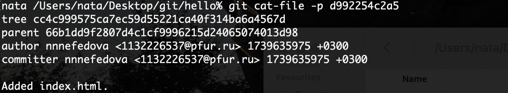

---
## Front matter
lang: ru-RU
title: Лабораторная работа №1
subtitle: Работа с git
author:
  - Нефедова Н.Н. 
institute:
  - Российский университет дружбы народов, Москва, Россия
date: 10 февраля 2024

## i18n babel
babel-lang: russian
babel-otherlangs: english

## Formatting pdf
toc: false
toc-title: Содержание
slide_level: 2
aspectratio: 169
section-titles: true
theme: metropolis
header-includes:
 - \metroset{progressbar=frametitle,sectionpage=progressbar,numbering=fraction}

---

# Информация

## Докладчик

:::::::::::::: {.columns align=center}
::: {.column width="70%"}

  * Нефедова Наталия Николавна
  * Студент
  * Обучающийся на кафедре математического моделирования и искусственного интеллекта
  * Российский университет дружбы народов
  * <https://github.com/nnnefedova>

:::
::::::::::::::

# Вводная часть

## Цели и задачи

- Научиться полному взаимодействию с git и разобрать основные его особенности.

# Основная часть

## Подготовка

{#fig:001 width=50%}

## Подготовка

{#fig:002 width=50%}

## Создание проекта

{#fig:003 width=35%}

## Создание проекта

{#fig:004 width=50%}

## Создание проекта

{#fig:005 width=50%}

## Создание проекта

{#fig:006 width=50%}

## Внесение изменений

{#fig:007 width=50%}

## Внесение изменений

{#fig:008 width=50%}

## Индексация изменений

{#fig:009 width=50%}

## Индексация изменений

{#fig:010 width=50%}

## Индексация изменений

{#fig:011 width=50%}

## Индексация изменений

{#fig:012 width=50%}

## Индексация изменений

{#fig:013 width=50%}

## Индексация изменений

{#fig:014 width=50%}

## Отмена локальных изменений (до индексации)

{#fig:015 width=50%}

## Отмена локальных изменений (до индексации)

{#fig:016 width=50%}

## Отмена локальных изменений (до индексации)

{#fig:017 width=50%}

## Отмена локальных изменений (до индексации)

{#fig:018 width=50%}

## Отмена коммитов 

{#fig:019 width=50%}

## Внесение изменений в коммиты

{#fig:020 width=50%}

## Внесение изменений в коммиты

{#fig:021 width=50%}

## Внесение изменений в коммиты

{#fig:022 width=50%}

## Перемещение файлов

{#fig:023 width=50%}

## Подробнее о структуре

{#fig:024 width=50%}

## Подробнее о структуре

{#fig:025 width=50%}

## Git внутри: Каталог .git

{#fig:026 width=50%}

## Git внутри: Каталог .git

{#fig:027 width=50%}

## Git внутри: Каталог .git

{#fig:028 width=50%}

## Git внутри: Каталог .git

{#fig:029 width=50%}

## Git внутри: Каталог .git

{#fig:030 width=50%}

## Работа непосредственно с объектами git

{#fig:031 width=50%}

## Работа непосредственно с объектами git

{#fig:032 width=50%}

## Создание ветки

{#fig:033 width=50%}

## Создание ветки

{#fig:034 width=50%}

## Создание ветки

{#fig:035 width=50%}

## Создание ветки

{#fig:036 width=50%}

## Создание ветки

{#fig:037 width=50%}

## Навигация по веткам

{#fig:038 width=40%}

## Навигация по веткам

{#fig:039 width=50%}

## Изменения в ветке master

{#fig:040 width=50%}

## Сделайте коммит изменений README.md в ветку master

{#fig:041 width=50%}

## Слияние

{#fig:042 width=40%}

## Создание конфликта

{#fig:043 width=50%}

## Разрешение конфликтов

{#fig:044 width=50%}

## Разрешение конфликтов

{#fig:045 width=50%}

## Слияние в ветку master

{#fig:046 width=50%}

## Клонирование репозиториев

{#fig:047 width=50%}

## Отправка изменений

{#fig:048 width=50%}

## Выводы

- В результате выполнения лабораторной работы мы научились полному взаимодействию с git и разобрали основные его особенности.
