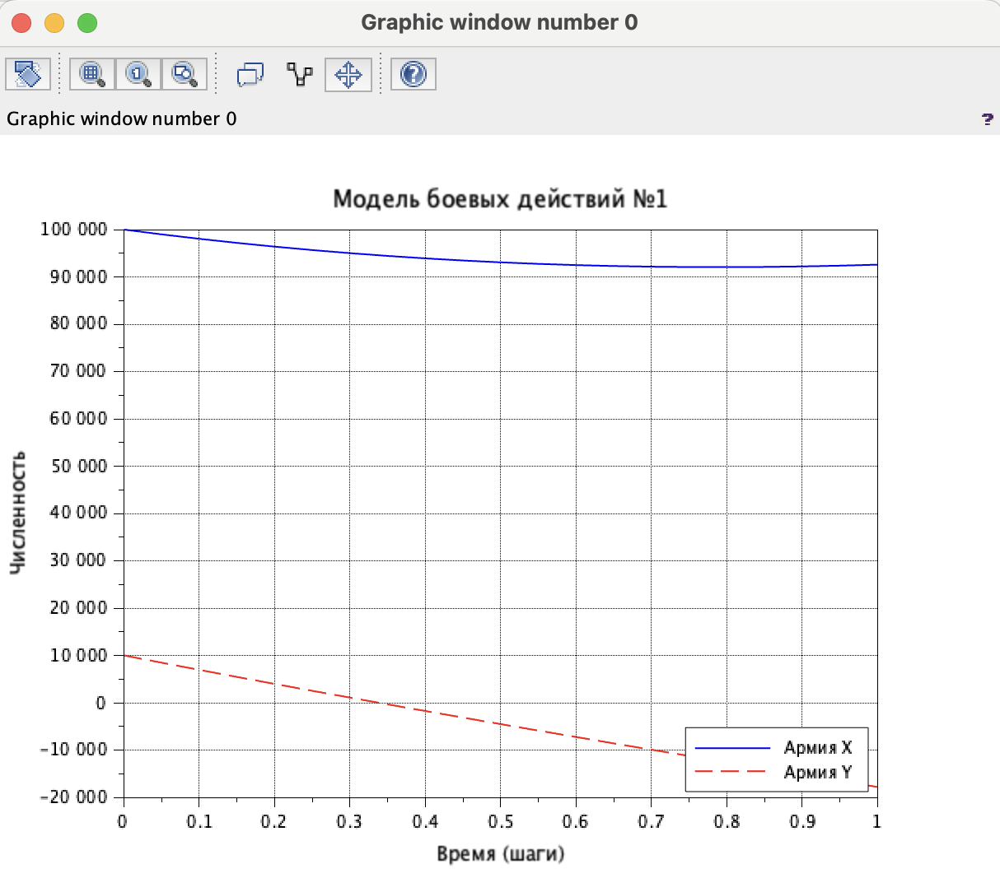
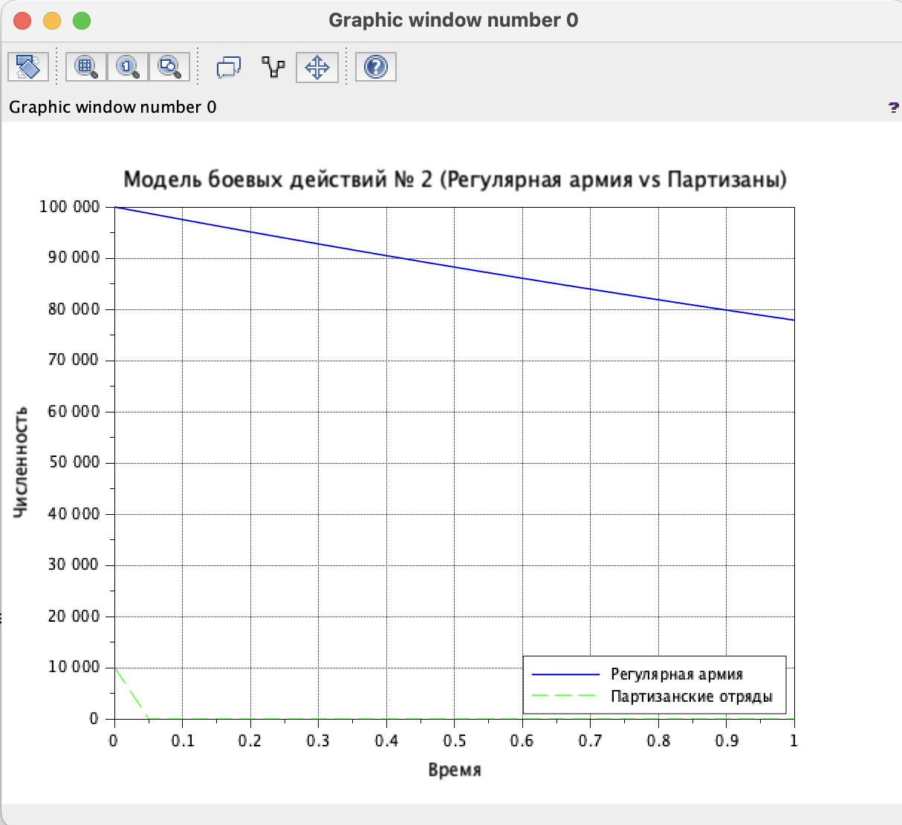

---
## Front matter
lang: ru-RU
title: Лабораторная работа №3
subtitle: Графики модели боевых действий, а также ознакомиться с Scilab
author:
  - Нефедова Н.Н. 
institute:
  - Российский университет дружбы народов, Москва, Россия
date: 20 марта 2024

## i18n babel
babel-lang: russian
babel-otherlangs: english

## Formatting pdf
toc: false
toc-title: Содержание
slide_level: 2
aspectratio: 169
section-titles: true
theme: metropolis
header-includes:
 - \metroset{progressbar=frametitle,sectionpage=progressbar,numbering=fraction}

---

# Информация

## Докладчик

:::::::::::::: {.columns align=center}
::: {.column width="70%"}

  * Нефедова Наталия Николавна
  * Студент
  * Обучающийся на кафедре математического моделирования и искусственного интеллекта
  * Российский университет дружбы народов
  * <https://github.com/nnnefedova>

:::
::::::::::::::

# Вводная часть

## Цель работы

Построить графики модели боевых действий, а также ознакомиться с Scilab

# Основная часть


## Задание
Рассмотреть некоторые простейшие модели боевых действий – модели
Ланчестера. В противоборстве могут принимать участие как регулярные войска,
так и партизанские отряды. В общем случае главной характеристикой соперников
являются численности сторон. Если в какой-то момент времени одна из
численностей обращается в нуль, то данная сторона считается проигравшей (при
условии, что численность другой стороны в данный момент положительна).
Рассмотрим три случая ведения боевых действий:

1. Боевые действия между регулярными войсками
2. Боевые действия с участием регулярных войск и партизанских
отрядов
3. Боевые действия между партизанскими отрядами

# Выполнение лабораторной работы 

Рассчитаем свой вариант по формуле и получаем наш вариант - 58


## 1. **Вариант 58**  
  Задача: Между страной Х и страной У идет война. Численность состава войск
исчисляется от начала войны, и являются временными функциями x(t) и y(t). В
начальный момент времени страна Х имеет армию численностью 500 000 человек,
а в распоряжении страны У армия численностью в 500 000 человек. Для упрощения
модели считаем, что коэффициенты a,b,c,h постоянны. 
постоянны. Также считаем P(t) и Q(t) непрерывные функции.
  Постройте графики изменения численности войск армии Х и армии У для
следующих случаев: 

## 1. Модель боевых действий между регулярными войсками  
  $\frac{\partial x}{\partial t} = -0,12x(t)-0,9y(t)+|sin(t)|$  
  $\frac{\partial y}{\partial t} = -0,3x(t)-0,1y(t)+|cos(t)|$

##  2. Модель ведение боевых действий с участием регулярных войск и
партизанских отрядов  

  $\frac{\partial x}{\partial t} = -0,25x(t)-0,96y(t)+sin(2t)+1$  
  $\frac{\partial y}{\partial t} = -0,25x(t)y(t)-0,3y(t)+cos(20t)+1$


## 2.1. Напишем первую программу для Scilab:
```
//начальные условия
x0 = 100000;//численность первой армии
y0 = 10000;//численность второй армии
t0 = 0;//начальный момент времени
a = 0.12;//константа, характеризующая степень влияния различных факторов на потери
b = 0.9;//эффективность боевых действий армии у
c = 0.3;//эффективность боевых действий армии х
h = 0.1;//константа, характеризующая степень влияния различных факторов на потери


## В результате выполнения кода мы получаем следующий график 

{#fig:001 width=200}


## Напишем вторую программу для Scilab:


##  В результате выполнения кода мы получаем следующий график 

{#fig:002 width=200}

## Выводы

Были изучены основы языка программирования Scilab и его библиотеки, А также рассмотрели простейшие модели боевых действий 

## Список литературы 

[1] Документация по Scilab: https://www.scilab.org/sites/default/files/Scilab_beginners.pdf

[2] Решение дифференциальных уравнений: https://www.wolframalpha.com/
