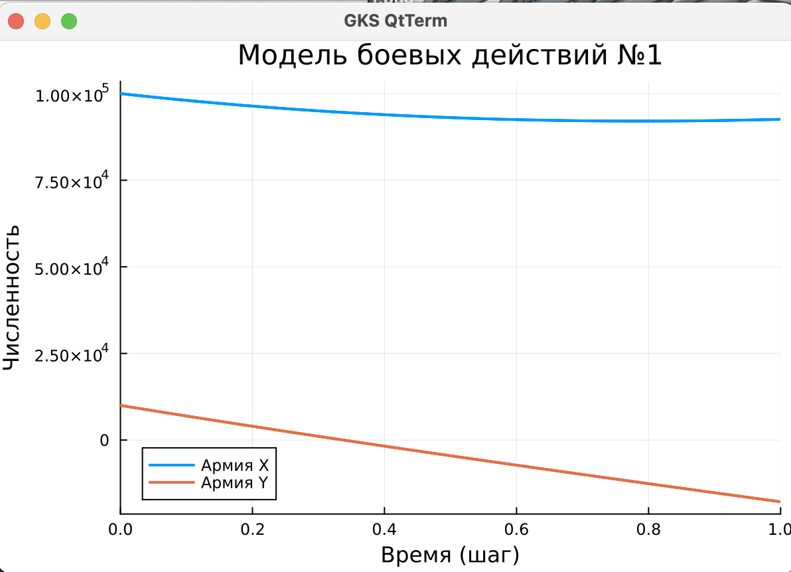
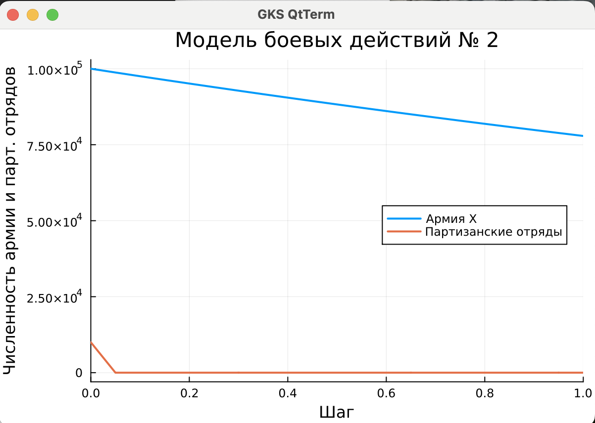

---
## Front matter
title: "Лабораторная работа №3"
subtitle: "Модель боевых действий"
author: "Нефедова Наталия Николаевна"

## Generic otions
lang: ru-RU
toc-title: "Содержание"

## Bibliography
bibliography: bib/cite.bib
csl: pandoc/csl/gost-r-7-0-5-2008-numeric.csl

## Pdf output format
toc: true # Table of contents
toc-depth: 2
lof: true # List of figures
lot: true # List of tables
fontsize: 12pt
linestretch: 1.5
papersize: a4
documentclass: scrreprt
## I18n polyglossia
polyglossia-lang:
  name: russian
  options:
	- spelling=modern
	- babelshorthands=true
polyglossia-otherlangs:
  name: english
## I18n babel
babel-lang: russian
babel-otherlangs: english
## Fonts
mainfont: PT Serif
romanfont: PT Serif
sansfont: PT Sans
monofont: PT Mono
mainfontoptions: Ligatures=TeX
romanfontoptions: Ligatures=TeX
sansfontoptions: Ligatures=TeX,Scale=MatchLowercase
monofontoptions: Scale=MatchLowercase,Scale=0.9
## Biblatex
biblatex: true
biblio-style: "gost-numeric"
biblatexoptions:
  - parentracker=true
  - backend=biber
  - hyperref=auto
  - language=auto
  - autolang=other*
  - citestyle=gost-numeric
## Pandoc-crossref LaTeX customization
figureTitle: "Рис."
tableTitle: "Таблица"
listingTitle: "Листинг"
lofTitle: "Список иллюстраций"
lotTitle: "Список таблиц"
lolTitle: "Листинги"
## Misc options
indent: true
header-includes:
  - \usepackage{indentfirst}
  - \usepackage{float} # keep figures where there are in the text
  - \floatplacement{figure}{H} # keep figures where there are in the text
---

# Цель работы

Построить графики модели боевых действий, а также ознакомиться с Scilab.

# Задание

**Вариант 58**  
  Задача: Между страной Х и страной У идет война. Численность состава войск
исчисляется от начала войны, и являются временными функциями x(t) и y(t). В
начальный момент времени страна Х имеет армию численностью 500 000 человек,
а в распоряжении страны У армия численностью в 500 000 человек. Для упрощения
модели считаем, что коэффициенты a,b,c,h постоянны. 
постоянны. Также считаем P(t) и Q(t) непрерывные функции.
  Постройте графики изменения численности войск армии Х и армии У для
следующих случаев: 

1. Модель боевых действий между регулярными войсками  
  $\frac{\partial x}{\partial t} = -0,12x(t)-0,9y(t)+|sin(t)|$  
  $\frac{\partial y}{\partial t} = -0,3x(t)-0,1y(t)+|cos(t)|$

2. Модель ведение боевых действий с участием регулярных войск и
партизанских отрядов  

  $\frac{\partial x}{\partial t} = -0,25x(t)-0,96y(t)+sin(2t)+1$  
  $\frac{\partial y}{\partial t} = -0,25x(t)y(t)-0,3y(t)+cos(20t)+1$

# Выполнение лабораторной работы

**1. Рассмотрим подробнее уравнения**

1.1. Потери, не связанные с боевыми действиями, описывают члены -0,12x(t) и -0,1y(t), 
члены -0,9y(t) и -0,3x(t) отражают потери на поле боя. Функции P(t)=|sin(t)|, Q(t)=|cos(t)| учитывают
возможность подхода подкрепления к войскам Х и У в течение одного дня. 

1.2. Потери, не связанные с боевыми действиями, описывают члены -0,25x(t) и -0,3y(t), 
члены -0,96y(t) и -0,25x(t)y(t) отражают потери на поле боя. Функции P(t)=sin(2t)+1, Q(t)=cos(20t)+1 учитывают
возможность подхода подкрепления к войскам Х и У в течение одного дня. 
  
1.3. Начальные условия для обоих случаев будут равно $x_{0}=100000$, $y_{0}=10000$

**2. Построение графиков численности войск**

2.1. Напишем первую программу для Scilab:
```
// Начальные условия
x0 = 100000;    // Численность первой армии
y0 = 10000;     // Численность второй армии
t0 = 0;         // Начальный момент времени
a = 0.12;       // Коэффициент потерь армии X
b = 0.9;        // Эффективность армии Y
c = 0.3;        // Эффективность армии X 
h = 0.1;        // Коэффициент потерь армии Y
dt = 0.05;      // Шаг времени
tmax = 1;       // Максимальное время
t = t0:dt:tmax; // Временная сетка

// Функции подкреплений (исправлен синтаксис модуля)
function p = P(t)
    p = abs(sin(t));  // Используем abs() вместо | |
endfunction

function q = Q(t)
    q = abs(cos(t));
endfunction

// Система ОДУ (исправлено объявление вектора)
function dy = syst(t, y)
    dy = zeros(2,1);  // Явное создание вектор-столбца
    dy(1) = -a*y(1) - b*y(2) + P(t);
    dy(2) = -c*y(1) - h*y(2) + Q(t);
endfunction

// Решение системы
v0 = [x0; y0];        // Начальные условия
y = ode(v0, t0, t, syst);

// Визуализация результатов
scf(0);
clf();
plot(t, y(1,:), 'b-', 'LineWidth', 2);  // Армия X - синий
plot(t, y(2,:), 'r--', 'LineWidth', 2); // Армия Y - красный пунктир
xgrid();
xtitle('Модель боевых действий №1', 'Время (шаги)', 'Численность');
legend(['Армия X'; 'Армия Y'], 4);      // Легенда в правом нижнем углу


```
В результате выполнения кода мы получаем следующий график (рис. -@fig:001).

{#fig:001 width=100%}

2.2. Напишем вторую программу для Scilab:
```

// Начальные условия
x0 = 100000;    // Численность первой армии
y0 = 10000;     // Численность партизанских отрядов
t0 = 0;         // Начальный момент времени
a = 0.25;       // Коэффициент потерь регулярной армии
b = 0.96;       // Эффективность партизанских действий 
c = 0.25;       // Эффективность регулярной армии
h = 0.3;        // Коэффициент потерь партизан
dt = 0.05;      // Шаг времени
tmax = 1;       // Максимальное время
t = t0:dt:tmax; // Временная сетка

// Функции подкреплений (исправлен синтаксис)
function p = P(t)
    p = sin(2*t) + 1;
endfunction

function q = Q(t)
    q = cos(20*t) + 1;  // Добавлен знак умножения *
endfunction

// Система ОДУ (исправлена инициализация вектора)
function dy = syst(t, y)
    dy = zeros(2,1);    // Явное создание вектор-столбца
    dy(1) = -a*y(1) - b*y(2) + P(t);
    dy(2) = -c*y(1)*y(2) - h*y(2) + Q(t);  // Нелинейный член
endfunction

// Решение системы
v0 = [x0; y0];          // Начальные условия
y = ode(v0, t0, t, syst);

// Визуализация результатов
scf(0);
clf();
plot(t, y(1,:), 'b-', 'LineWidth', 2);  // Регулярная армия - синий
plot(t, y(2,:), 'g--', 'LineWidth', 2); // Партизаны - зеленый пунктир
xgrid();
xtitle('Модель боевых действий № 2 (Регулярная армия vs Партизаны)', 'Время', 'Численность');
legend(['Регулярная армия'; 'Партизанские отряды'], 4);


```
В результате выполнения кода мы получаем следующий график (рис. -@fig:002).

{#fig:002 width=100%}

# Выводы

В результате выполнения лабораторной работы мы научились решать и строить графики модели боевых действий в среде Scilab.

# Список литературы{.unnumbered}

[1] ТУИС РУДН
