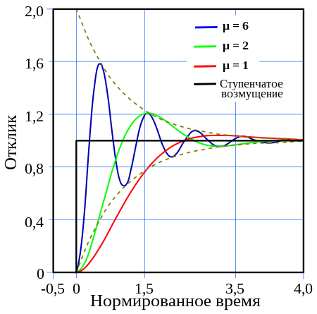
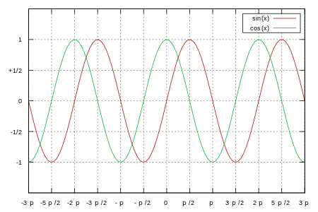
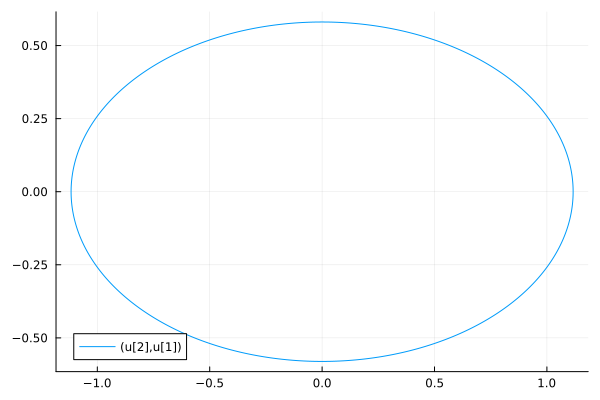
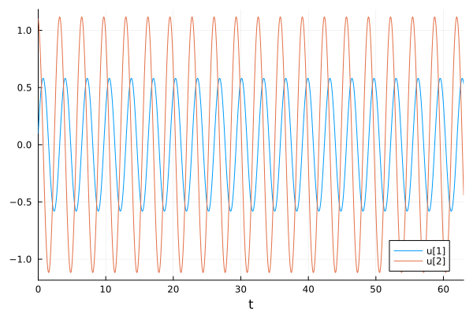
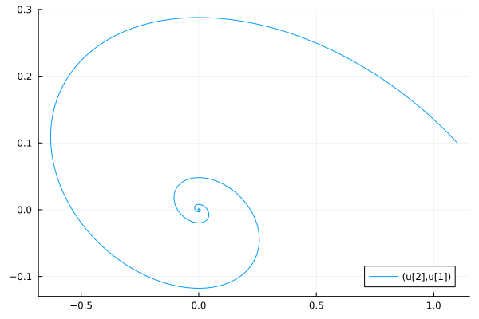
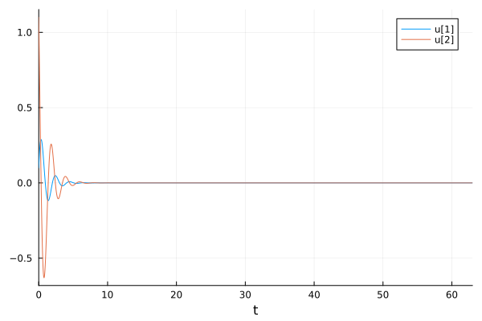
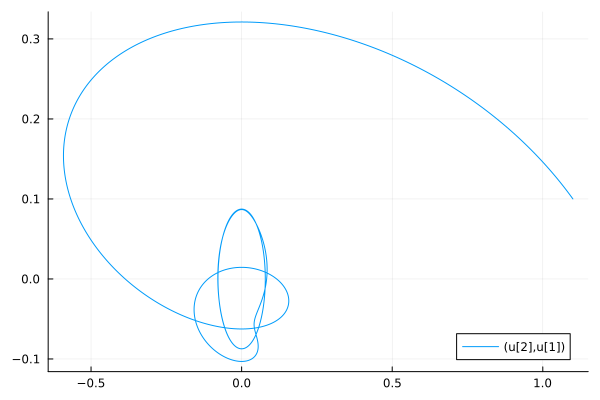
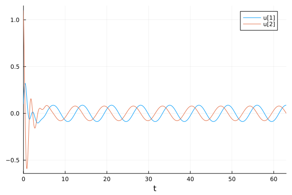

---
## Front matter
lang: ru-RU
title: Лабораторная работа №4
subtitle: "Модель гармонических колебаний"
author:
  - Нефедова Н.Н. 
institute:
  - Российский университет дружбы народов, Москва, Россия
date: 23 марта 2024

## i18n babel
babel-lang: russian
babel-otherlangs: english

## Formatting pdf
toc: false
toc-title: Содержание
slide_level: 2
aspectratio: 169
section-titles: true
theme: metropolis
header-includes:
 - \metroset{progressbar=frametitle,sectionpage=progressbar,numbering=fraction}
 - '\makeatletter'
 - '\beamer@ignorenonframefalse'
 - '\makeatother'
---

# Информация

## Докладчик

:::::::::::::: {.columns align=center}
::: {.column width="70%"}

  * Нефедова Наталия Николаевна
  * Студент
  * Обучающийся на кафедре математического моделирования и искусственного интеллекта
  * Российский университет дружбы народов
  * <https://github.com/nnnefedova>

:::
::::::::::::::

## Цель лабораторной работы

- Изучить понятие гармонического осциллятора, построить фазовый портрет и найти решение уравнения гармонического осциллятора. 

## Теоретическое введние (1)

- Гармонический осциллятор [1] — система, которая при смещении из положения равновесия испытывает действие возвращающей силы F, пропорциональной смещению x.

{#fig:101 width=50% height=50%}

## Теоретическое введние (2)

- Гармоническое колебание [2] - колебание, в процессе которого величины, характеризующие движение (смещение, скорость, ускорение и др.), изменяются по закону синуса или косинуса (гармоническому закону).

{#fig:102 width=50% height=50%}

## Математическая модель (1)

Движение грузика на пружинке, маятника, заряда в электрическом контуре, а также эволюция во времени многих систем в физике, химии, биологии и других науках при определенных предположениях можно описать одним и тем же дифференциальным уравнением, которое в теории колебаний выступает в качестве основной модели. Эта модель называется линейным гармоническим осциллятором.

## Математическая модель (2)

Уравнение свободных колебаний гармонического осциллятора имеет следующий вид:
$$\ddot{x} + 2\gamma\dot{x} + \omega_0^2 x = 0,$$

где $x$ — переменная, описывающая состояние системы (смещение грузика, заряд конденсатора и т. д.), $\gamma$ — параметр, характеризующий потери энергии (трение в механической системе, сопротивление в контуре), $\omega_0$ — собственная частота колебаний.  
Это уравнение является линейным однородным дифференциальным уравнением второго порядка и представляет собой пример линейной динамической системы.

## Математическая модель (3)

Значение фазовых координат $x, y$ в любой момент времени полностью определяет состояние системы. Решению уравнения движения как функции времени соответствует гладкая кривая в фазовой плоскости. Она называется фазовой траекторией. Если множество различных решений (соответствующих различным начальным условиям) изобразить на одной фазовой плоскости, возникает общая картина поведения системы. Такую картину, образованную набором фазовых траекторий, называют фазовым портретом.

## Задание лабораторной работы. Вариант 58

Постройте фазовый портрет гармонического осциллятора и решение уравнения гармонического осциллятора для следующих случаев:

1. Колебания гармонического осциллятора без затуханий и без действий внешней силы:
   $$\ddot{x} + 30x = 0.$$

2. Колебания гармонического осциллятора с затуханием и без действий внешней силы:
   $$\ddot{x} + 10\dot{x} + 20x = 0.$$

3. Колебания гармонического осциллятора с затуханием и под действием внешней силы:
   $$\ddot{x} + 17\dot{x} + 3x = 0.9\cos(10t).$$

На интервале $$t \in [0; 77]$$ (шаг $$0.05$$) с начальными условиями $$x_0 = 0, \quad y_0 = -0.6$$.

На интервале$ $t\in [0;77]$ (шаг $$0.05$$) с начальными условиями $$x_0=0, y_0=-0.6$$.

## Задачи:

1. Разобраться в понятии гармонического осциллятора

2. Ознакомиться с уравнением свободных колебаний гармонического осциллятора

3. Построить фазовый портрет гармонического осциллятора и решение уравнения на языках Julia игармонического осциллятора для следующих случаев:

- Колебания гармонического осциллятора без затуханий и без действий внешней силы

- Колебания гармонического осциллятора c затуханием и без действий внешней силы

- Колебания гармонического осциллятора c затуханием и под действием внешней силы

# Ход выполнения лабораторной работы

## Математическая модель

По представленному выше теоретическому материалу были составлены модели на обоих языках программирования.

# Решение с помощью программы Julia

## Результаты работы кода на Julia

# Первый случай: 

Колебания гармонического осциллятора без затуханий и без действий внешней силы

## Решение уравнения для колебания гармонического осциллятора без затуханий и без действий внешней силы на языке Julia

{#fig:001}

## Фазовый потрет для колебания гармонического осциллятора без затуханий и без действий внешней силы на языке Julia

{#fig:002}

# Второй случай:

Колебания гармонического осциллятора c затуханием и без действий внешней силы

## Решение уравнения для колебания гармонического осциллятора c затуханием и без действий внешней силы на языке Julia

{#fig:003}

## Фазовый потрет для колебания гармонического осциллятора c затуханием и без действий внешней силы на языке Julia

{#fig:004}

# Третий случай:

Колебания гармонического осциллятора c затуханием и под действием внешней силы

## Решение уравнения для колебания гармонического осциллятора cc затуханием и под действием внешней силы на языке Julia

{#fig:005}
 
 
 ## Фазовый потрет для колебания гармонического осциллятора c затуханием и под действием внешней силы на языке Julia
{#fig:006}

# Вывод

## Вывод

В ходе выполнения лабораторной работы были построены решения уравнения гармонического осциллятора и фазовые портреты гармонических колебаний без затухания, с затуханием и при действии внешней силы на языкe Julia

# Список литературы. Библиография

[1] Документация по Julia: https://docs.julialang.org/en/v1/