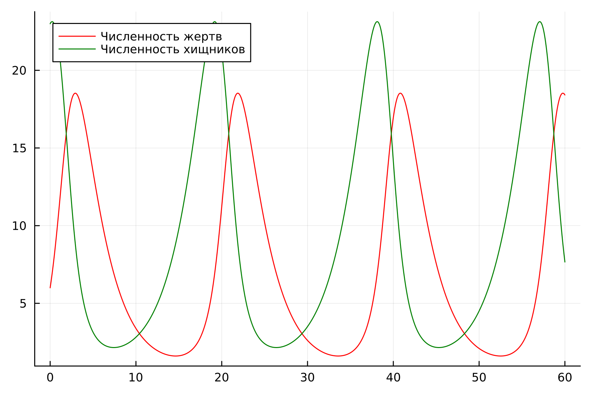

---
## Front matter
lang: ru-RU
title: Лабораторная работа №5
subtitle: "Модель хищник-жертва"
author:
  - Нефедова Н.Н. 
institute:
  - Российский университет дружбы народов, Москва, Россия
date: 31 марта 2024

## i18n babel
babel-lang: russian
babel-otherlangs: english

## Formatting pdf
toc: false
toc-title: Содержание
slide_level: 2
aspectratio: 169
section-titles: true
theme: metropolis
header-includes:
 - \metroset{progressbar=frametitle,sectionpage=progressbar,numbering=fraction}
 - '\makeatletter'
 - '\makeatother'
---

## Докладчик

:::::::::::::: {.columns align=center}
::: {.column width="70%"}

  * Нефедова Наталия Николаевна
  * Студент
  * Обучающийся на кафедре математического моделирования и искусственного интеллекта
  * Российский университет дружбы народов
  * <https://github.com/nnnefedova>

:::
::: {.column width="30%"}

:::
::::::::::::::

## Цель лабораторной работы

- Изучить жесткую модель хищник-жертва и построить эту модель.

## Теоретическое введние (1)

- Модель Лотки—Вольтерры — модель взаимодействия двух видов типа «хищник — жертва», названная в честь её авторов, которые предложили модельные уравнения независимо друг от друга. Такие уравнения можно использовать для моделирования систем «хищник — жертва», «паразит — хозяин», конкуренции и других видов взаимодействия между двумя видами. [4]

## Теоретическое введние (2)

Данная двувидовая модель основывается на
следующих предположениях:

1. Численность популяции жертв x и хищников y зависят только от времени (модель не учитывает пространственное распределение популяции на занимаемой территории)

2. В отсутствии взаимодействия численность видов изменяется по модели Мальтуса, при этом число жертв увеличивается, а число хищников падает

3. Естественная смертность жертвы и естественная рождаемость хищника считаются несущественными

4. Эффект насыщения численности обеих популяций не учитывается

5. Скорость роста численности жертв уменьшается пропорционально численности хищников

## Математическая модель (1)

$$

{dx}{dt} &= (-ax(t) + by(t)x(t)) 
{dy}{dt} &= (cy(t) - dy(t)x(t))

$$

В этой модели $x$ – число жертв, $y$ - число хищников.
Коэффициент $a$ описывает скорость естественного прироста числа жертв в отсутствие хищников, $с$ - естественное вымирание хищников, лишенных пищи в виде жертв.
Вероятность взаимодействия жертвы и хищника считается пропорциональной как количеству жертв, так и числу самих хищников ($xy$).
Каждый акт взаимодействия уменьшает популяцию жертв, но способствует увеличению популяции хищников (члены $-bxy$ и $dxy$ в правой части уравнения).

## Математическая модель (2)

Математический анализ этой (жёсткой) модели показывает, что имеется стационарное состояние, всякое же другое начальное состояние приводит
к периодическому колебанию численности как жертв, так и хищников, так что по прошествии некоторого времени такая система вернётся в изначальное состояние.

## Математическая модель (3)

Стационарное состояние системы (положение равновесия, не зависящее от времени решения) будет находиться в точке . Если начальные значения задать в стационарном состоянии $x(0) = x_0, y(0) = y_0$, то в любой момент времени
численность популяций изменяться не будет. При малом отклонении от положения равновесия численности как хищника, так и жертвы с течением времени не
возвращаются к равновесным значениям, а совершают периодические колебания вокруг стационарной точки. Амплитуда колебаний и их период определяется
начальными значениями численностей $x(0), y(0)$. Колебания совершаются в противофазе.

## Задание лабораторной работы. Вариант 59

Для модели «хищник-жертва»:

$$

{dx}{dt} = -0.48x(t) + 0.053y(t)x(t) 
{dy}{dt} = 0.52y(t) - 0.048y(t)x(t)

$$

Постройте график зависимости численности хищников от численности жертв, а также графики изменения численности хищников и численности жертв
при следующих начальных условиях: $x_0=6, y_0=21$
Найдите стационарное состояние системы.

## Задачи:

1. Построить график зависимости численности хищников от численности жертв

2. Построить график зависимости численности хищников и численности жертв от времени

3. Найти стационарное состояние системы

# Ход выполнения лабораторной работы
## Математическая модель

По представленному выше теоретическому материалу были составлены модели на обоих языках программирования.

# Решение с помощью программ

## Результаты работы кода на Julia и Scilab для первого случая (График численности хищников от численности жертв)

:::::::::::::: {.columns align=center}
::: {.column width="50%"}

{#fig:001}

::: 
::: {.column width="50%"}

{#fig:004 width=90% height=90%}

:::
::::::::::::::

## Результаты работы кода на Julia и Scilab для второго случая (График численности жертв и хищников от времени)

:::::::::::::: {.columns align=center}
::: {.column width="50%"}

{#fig:002}

::: 
::: {.column width="50%"}

{#fig:005 width=90% height=90%}

:::
::::::::::::::

## Анализ полученных результатов

В итоге проделанной работы мы построили график зависимости численности хищников от численности жертв, а также графики изменения численности хищников и численности жертв на языках Julia и Scilab. Построение модели хищник-жертва на языке Scilab занимает меньше строк, чем аналогичное построение на Julia.

# Вывод

## Вывод

В ходе выполнения лабораторной работы была изучена модель хищник-жертва и построена модель на языках Julia и Open Modelica.

# Список литературы. Библиография

[1] Документация по Julia: https://docs.julialang.org/en/v1/
