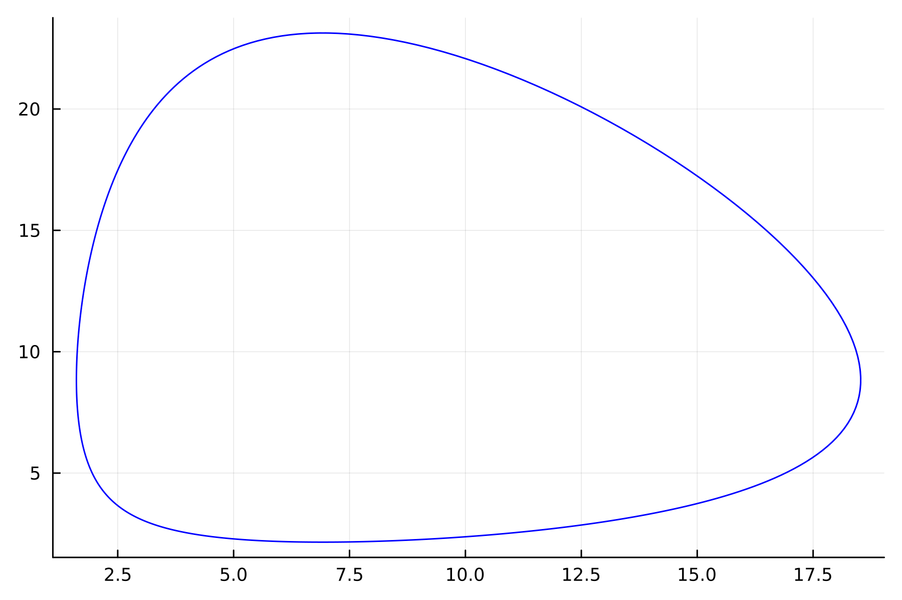
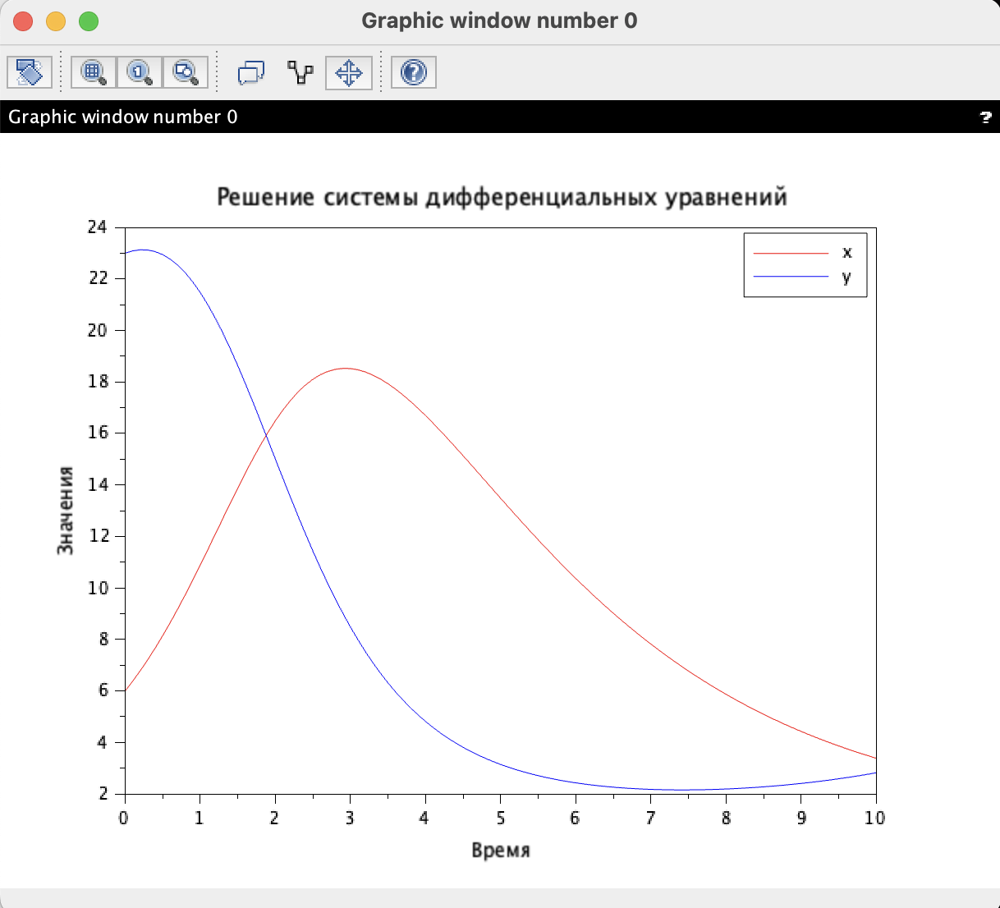
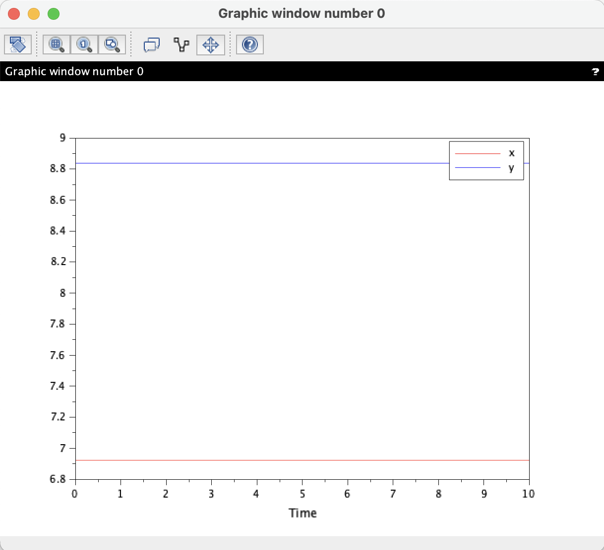

---
## Front matter
title: "Лабораторная работа №5"
subtitle: "Модель хищник-жертва. Вариант №58"
author: "Нефедова Наталия Николаевна"

## Generic otions
lang: ru-RU
toc-title: "Содержание"


## Generic otions
lang: ru-RU
toc-title: "Содержание"

## Bibliography
bibliography: bib/cite.bib
csl: pandoc/csl/gost-r-7-0-5-2008-numeric.csl

## Pdf output format
toc: true # Table of contents
toc-depth: 2
lof: true # List of figures
fontsize: 12pt
linestretch: 1.5
papersize: a4
documentclass: scrreprt
## I18n polyglossia
polyglossia-lang:
  name: russian
  options:
	- spelling=modern
	- babelshorthands=true
polyglossia-otherlangs:
  name: english
## I18n babel
babel-lang: russian
babel-otherlangs: english
## Fonts
mainfont: PT Serif
romanfont: PT Serif
sansfont: PT Sans
monofont: PT Mono
mainfontoptions: Ligatures=TeX
romanfontoptions: Ligatures=TeX
sansfontoptions: Ligatures=TeX,Scale=MatchLowercase
monofontoptions: Scale=MatchLowercase,Scale=0.9
## Biblatex
biblatex: true
biblio-style: "gost-numeric"
biblatexoptions:
  - parentracker=true
  - backend=biber
  - hyperref=auto
  - language=auto
  - autolang=other*
  - citestyle=gost-numeric
## Pandoc-crossref LaTeX customization
figureTitle: "Рис."
tableTitle: "Таблица"
listingTitle: "Листинг"
lofTitle: "Список иллюстраций"
lolTitle: "Листинги"
## Misc options
indent: true
header-includes:
  - \usepackage{indentfirst}
  - \usepackage{float} # keep figures where there are in the text
  - \floatplacement{figure}{H} # keep figures where there are in the text
---

# Цель работы

Изучить жесткую модель хищник-жертва и построить эту модель.

# Теоретическое введение

- Модель Лотки—Вольтерры — модель взаимодействия двух видов типа «хищник — жертва», названная в честь её авторов, которые предложили модельные уравнения независимо друг от друга. Такие уравнения можно использовать для моделирования систем «хищник — жертва», «паразит — хозяин», конкуренции и других видов взаимодействия между двумя видами. [4]

Данная двувидовая модель основывается на
следующих предположениях [4]:

1. Численность популяции жертв x и хищников y зависят только от времени (модель не учитывает пространственное распределение популяции на занимаемой территории)

2. В отсутствии взаимодействия численность видов изменяется по модели Мальтуса, при этом число жертв увеличивается, а число хищников падает

3. Естественная смертность жертвы и естественная рождаемость хищника считаются несущественными

4. Эффект насыщения численности обеих популяций не учитывается

5. Скорость роста численности жертв уменьшается пропорционально численности хищников

$$
 \begin{cases}
	\frac{dx}{dt} = (-ax(t) + by(t)x(t))
	\\   
	\frac{dy}{dt} = (cy(t) - dy(t)x(t))
 \end{cases}
$$

В этой модели $x$ – число жертв, $y$ - число хищников.
Коэффициент $a$ описывает скорость естественного прироста числа жертв в отсутствие хищников, $с$ - естественное вымирание хищников, лишенных пищи в виде жертв.
Вероятность взаимодействия жертвы и хищника считается пропорциональной как количеству жертв, так и числу самих хищников ($xy$).
Каждый акт взаимодействия уменьшает популяцию жертв, но способствует увеличению популяции хищников (члены $-bxy$ и $dxy$ в правой части уравнения).

Математический анализ этой (жёсткой) модели показывает, что имеется стационарное состояние, всякое же другое начальное состояние приводит
к периодическому колебанию численности как жертв, так и хищников, так что по прошествии некоторого времени такая система вернётся в изначальное состояние.

Стационарное состояние системы (положение равновесия, не зависящее от времени решения) будет находиться
в точке $x_0=\frac{c}{d}, y_0=\frac{a}{b}$. Если начальные значения задать в стационарном состоянии $x(0) = x_0, y(0) = y_0$, то в любой момент времени
численность популяций изменяться не будет. При малом отклонении от положения равновесия численности как хищника, так и жертвы с течением времени не
возвращаются к равновесным значениям, а совершают периодические колебания вокруг стационарной точки. Амплитуда колебаний и их период определяется
начальными значениями численностей $x(0), y(0)$. Колебания совершаются в противофазе.

# Задачи

1. Построить график зависимости численности хищников от численности жертв

2. Построить график зависимости численности хищников и численности жертв от времени

3. Найти стационарное состояние системы

# Задание

Вариант 58:

Для модели «хищник-жертва»:

$$
 \begin{cases}
	\frac{dx}{dt} = -0.38x(t) + 0.043y(t)x(t)
	\\   
	\frac{dy}{dt} = 0.36y(t) - 0.052y(t)x(t)
 \end{cases}
$$

Постройте график зависимости численности хищников от численности жертв, а также графики изменения численности хищников и численности жертв 
при следующих начальных условиях: $x_0=6, y_0=23$
Найдите стационарное состояние системы.

# Выполнение лабораторной работы

## Построение математической модели. Решение с помощью программ

### Julia

Код программы для нестационарного состояния:

```
using Plots
using DifferentialEquations

x0 = 6
y0 = 23

a = 0.38
b = 0.043
c = 0.36
d = 0.052


function ode_fn(du, u, p, t)
    x, y = u
    du[1] = -a*u[1] + b * u[1] * u[2]
    du[2] = c * u[2] - d * u[1] * u[2]
end

v0 = [x0, y0]
tspan = (0.0, 60.0)
prob = ODEProblem(ode_fn, v0, tspan)
sol = solve(prob, dtmax=0.05)
X = [u[1] for u in sol.u]
Y = [u[2] for u in sol.u]
T = [t for t in sol.t]

plt = plot(
  dpi=300,
  legend=false)

plot!(
  plt,
  X,
  Y,
  color=:blue)

savefig(plt, "lab5_julia_1.png")

plt2 = plot(
  dpi=300,
  legend=true)

plot!(
  plt2,
  T,
  X,
  label="Численность жертв",
  color=:red)

plot!(
  plt2,
  T,
  Y,
  label="Численность хищников",
  color=:green)

savefig(plt2, "lab5_julia_2.png")
```

Код программы для стационарного состояния:

```
using Plots
using DifferentialEquations

a = 0.38
b = 0.043
c = 0.36
d = 0.052


x0 = c / d 
y0 = a / b 

function ode_fn(du, u, p, t)
    x, y = u
    du[1] = -a*u[1] + b * u[1] * u[2]
    du[2] = c * u[2] - d * u[1] * u[2]
end

v0 = [x0, y0]
tspan = (0.0, 60.0)
prob = ODEProblem(ode_fn, v0, tspan)
sol = solve(prob, dtmax=0.05)
X = [u[1] for u in sol.u]
Y = [u[2] for u in sol.u]
T = [t for t in sol.t]

plt2 = plot(
  dpi=300,
  legend=true)

plot!(
  plt2,
  T,
  X,
  label="Численность жертв",
  color=:red)

plot!(
  plt2,
  T,
  Y,
  label="Численность хищников",
  color=:green)

savefig(plt2, "lab5_julia_3.png")
```
В стационарном состоянии решение вида $y(x)=some function$ будет представлять собой точку.

### Результаты работы кода на Julia

{ #fig:001 width=70% height=70% }

{ #fig:002 width=70% height=70% }

{ #fig:003 width=70% height=70% }

## OpenModelica

Код программы для нестационарного состояния:

```
function dxdt = system(t, X)
    // Параметры системы
    a = 0.38;
    b = 0.043;
    c = 0.36;
    d = 0.052;
    
    // Переменные системы
    x = X(1);
    y = X(2);
    
    // Дифференциальные уравнения
    dxdt(1) = -a*x + b*x*y;
    dxdt(2) = c*y - d*x*y;
endfunction

// Начальные условия
x0 = 6;
y0 = 23;
X0 = [x0; y0];

// Временной интервал для решения
t0 = 0;
t = 0:0.1:10; // От 0 до 10 с шагом 0.1

// Решение системы дифференциальных уравнений
X = ode(X0, t0, t, system);

// Построение графиков
scf();
plot(t, X(1,:), 'r', t, X(2,:), 'b');
xlabel('Время');
ylabel('Значения');
legend(['x'; 'y']);
title('Решение системы дифференциальных уравнений');

```
Код программы для стационарного состояния:

```
function dxdt = system(t, X)
    a = 0.38;
    b = 0.043;
    c = 0.36;
    d = 0.052;
    dxdt(1) = -a*X(1) + b*X(1)*X(2);
    dxdt(2) = c*X(2) - d*X(1)*X(2);
endfunction

a = 0.38;
b = 0.043;
c = 0.36;
d = 0.052;
X0 = [c/d; a/b];
t = 0:0.1:10;

X = ode(X0, 0, t, system);

scf();
plot(t, X(1,:), 'r', t, X(2,:), 'b');
xlabel('Time');
legend(['x'; 'y']);

```
В стационарном состоянии решение вида $y(x)=some function$ будет представлять собой точку.

### Результаты работы кода на Scilab

{ #fig:004 width=70% height=70% }

{ #fig:005 width=70% height=70% }


# Анализ полученных результатов. Сравнение языков.

В итоге проделанной работы мы построили график зависимости численности хищников от численности жертв, а также графики изменения численности хищников и численности жертв на языках Julia и Scilab. Построение модели хищник-жертва на языке Scilab занимает меньше строк, чем аналогичное построение на Julia.

# Вывод

В ходе выполнения лабораторной работы была изучена модель хищник-жертва и построена модель на языках Julia и Open Modelica.

# Список литературы. Библиография

[1] Документация по Julia: https://docs.julialang.org/en/v1/

[2] Документация по OpenModelica: https://openmodelica.org/

[3] Решение дифференциальных уравнений: https://www.wolframalpha.com/

[4] Модель Лотки—Вольтерры: https://math-it.petrsu.ru/users/semenova/MathECO/Lections/Lotka_Volterra.pdf