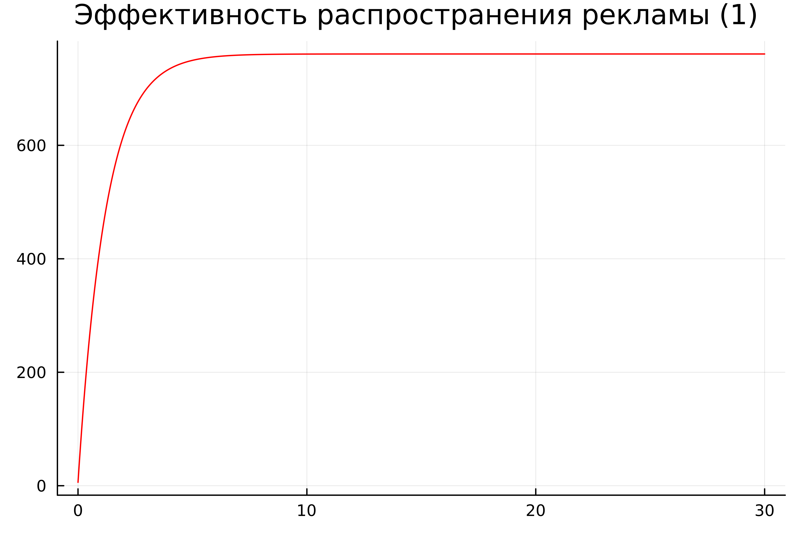
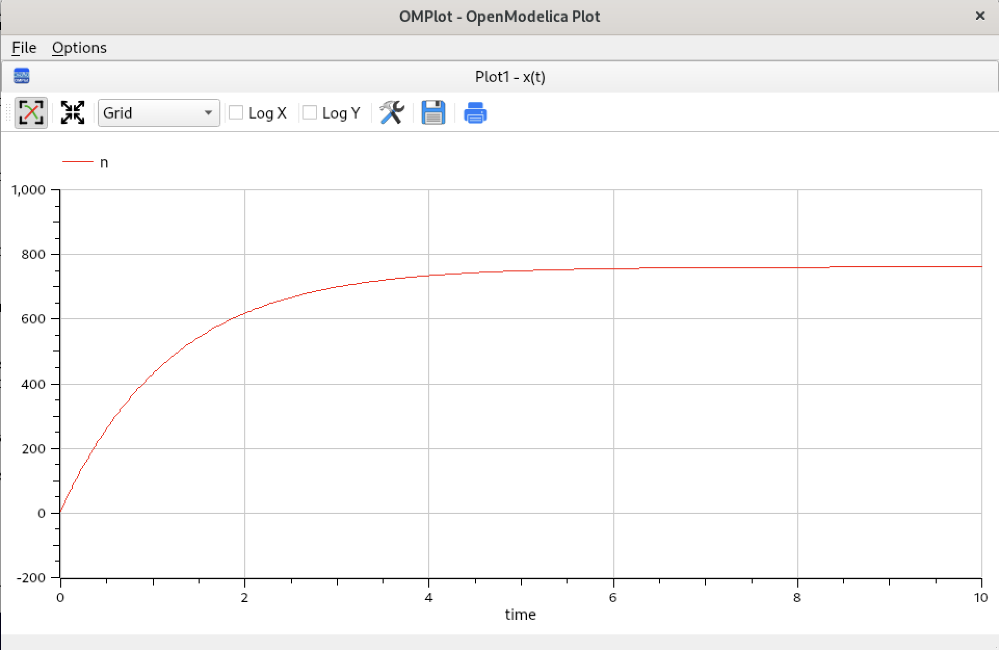
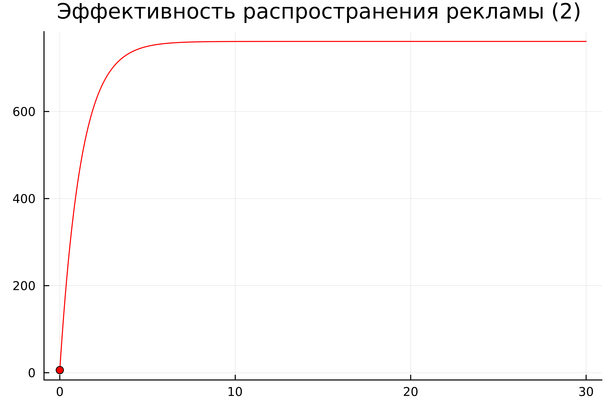
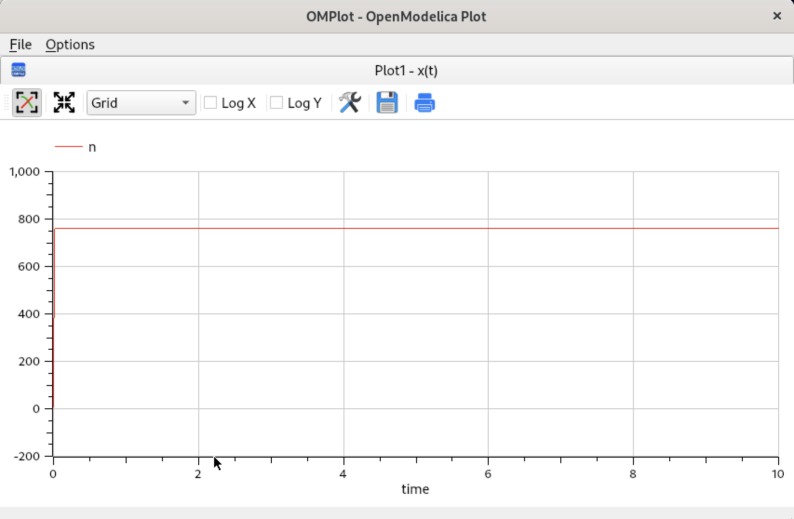
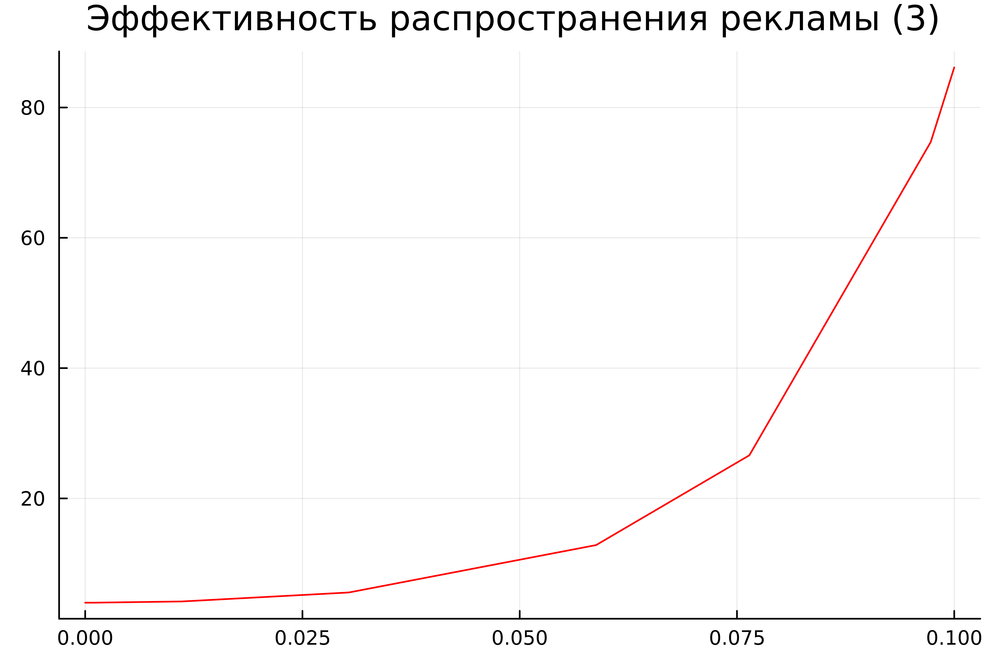
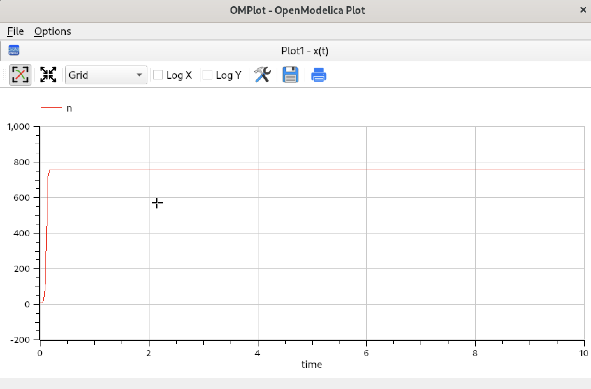

---
## Front matter
lang: ru-RU
title: Лабораторная работа №7
subtitle: "Модель рекламы"
author:
  - Нефедова Н.Н. 
institute:
  - Российский университет дружбы народов, Москва, Россия
date: 11 апреля 2025

## i18n babel
babel-lang: russian
babel-otherlangs: english

## Formatting pdf
toc: false
toc-title: Содержание
slide_level: 2
aspectratio: 169
section-titles: true
theme: metropolis
header-includes:
 - \metroset{progressbar=frametitle,sectionpage=progressbar,numbering=fraction}
 - '\makeatletter'
 - '\makeatother'
---

# Информация

## Докладчик

  * Нефедова Наталия Николаевна
  * Студент
  * Обучающийся на кафедре математического моделирования и искусственного интеллекта
  * Российский университет дружбы народов
  * <https://github.com/nnnefedova>

## Цель лабораторной работы

- Изучить и построить модель эффективности рекламы

# Теоретическое введение. Построение математической модели.

Организуется рекламная кампания нового товара или услуги. Необходимо, чтобы прибыль будущих продаж с избытком покрывала издержки на рекламу. Вначале расходы могут превышать прибыль, поскольку лишь малая часть потенциальных покупателей будет информирована о новинке. Затем, при увеличении числа продаж, возрастает и прибыль, и, наконец, наступит момент, когда рынок насытиться, и рекламировать товар станет бесполезным.

## Задание лабораторной работы. Вариант 58

Постройте график распространения рекламы, математическая модель которой описывается следующим уравнением:

При этом объем аудитории N = 761, в начальный момент о товаре знает 6 человек.

Для случая 2 определите в какой момент времени скорость распространения рекламы будет иметь максимальное значение.

# Ход выполнения лабораторной работы

## Математическая модель

По представленному выше теоретическому материалу были составлены модели на обоих языках программирования.

# Решение с помощью программ

## Результаты работы кода на Julia и Open Modelica для первого случая 0.82 + 0.00003n(t))(N-n(t))

{#fig:001}

## Результаты работы кода на Julia 

{#fig:002}

## Результаты работы кода на Julia и Open Modelica для случая (0.00003 + 0.82n(t))(N-n(t)

{#fig:003}

## Результаты работы кода на Julia и Open Modelica для случая (0.00003 + 0.82n(t))(N-n(t)

{#fig:004}

## Результаты работы кода на Julia 

## Результаты работы кода на Julia и Open Modelica для случая  (0.2sin{t} + 0.8 * t * n(t))(N-n(t))

{#fig:005}

## Результаты работы кода на Open Modelica 

{#fig:006}

## Анализ полученных результатов. Сравнение языков.

- В итоге проделанной работы мы построили графики распространения рекламы для трех случаев на языках Julia и OpenModelica. Построение модели распространения рекламы на языке OpenModelica занимает значительно меньше строк, чем аналогичное построение на Julia

- Кроме того, построения на языке OpenModelica проводятся относительно значения времени t по умолчанию, что упрощает нашу работу

# Вывод

## Вывод

В ходе выполнения лабораторной работы была изучена модель эффективности рекламы и в дальнейшем построена модель на языках Julia и Open Modelica.

## Список литературы. Библиография

[1] Документация по Julia: https://docs.julialang.org/en/v1/

[2] Документация по OpenModelica: https://openmodelica.org/

[3] Решение дифференциальных уравнений: https://www.wolframalpha.com/

[4] Мальтузианская модель роста: https://www.stolaf.edu//people/mckelvey/envision.dir/malthus.html

